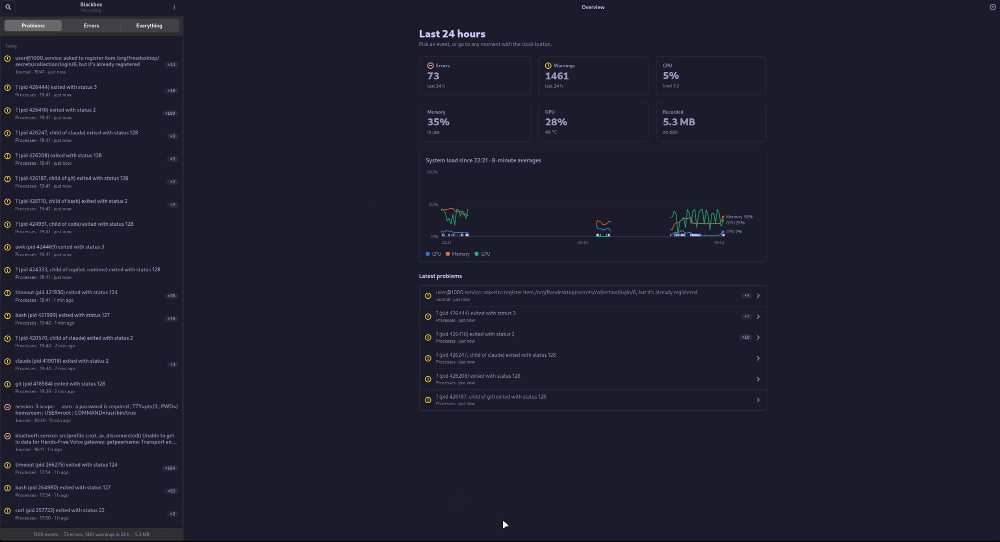

# Blackbox

**A flight recorder for a Linux desktop.** A small Rust service runs all the time and keeps what you
need after something goes wrong: crashes, error logs, failed logins, package upgrades, freezes and
system load. A desktop app shows any of those moments together with everything else that was
happening on the machine at the time.



## Why

When a desktop freezes, a program crashes or a login fails, the evidence is spread across the
journal, the audit log, coredumps and pacman's log. By the time you go looking, part of it has
usually rotated away, and nothing lines it up in time. So "what happened at 14:02, and what else was
going on?" means an hour of `journalctl` and `grep`.

Blackbox answers that question in one click. It records continuously, into one SQLite file, and
costs so little that you never notice it running.

## What it records

| Source | What is kept |
|---|---|
| **Processes** | Every crash (SIGSEGV, SIGABRT, SIGBUS, SIGILL, SIGFPE, SIGTRAP, SIGSYS), named and with its stack trace from systemd-coredump, and every other failed exit (status 2 or higher), such as a Rust panic (101). A script stopped by Ctrl-C, `timeout` or systemd (130, 143, …) is not a failure and is skipped |
| **System** | CPU, memory, disk I/O and load every 10 s, NVIDIA GPU load, memory and temperature every 30 s |
| **journald** | Warnings and worse, plus Rust panics (which are logged at info level) |
| **auditd** | Failed logins and authentication, sudo use, kernel module loads, edits to identity and boot files, audit anomalies |
| **Packages** | Every pacman transaction, with kernel, driver and systemd upgrades listed first |
| **Boots** | Every boot, and any previous boot that ended without a clean shutdown (a freeze, a kernel panic, a power loss), placed at the moment it stopped |

It deliberately does **not** record every fork, exec or clean exit. That would be about 100 events a
second of noise and would bury the few that matter.

## How it works

```
 kernel process events ──(BPF filter)──► collector ─┐
 /proc, nvidia-smi ─────────────────────► sampler ──┤
 journalctl --follow ───────────────────► journald ─┼──► database.rs ──► blackbox.db ◄── Blackbox app
 audit.log ─────────────────────────────► auditd ───┤    one writer,      SQLite, WAL,   GTK4, read-only,
 pacman.log ────────────────────────────► pacman ───┤    one transaction  7.5 GB ring    runs only while
 previous boot's last journal entry ────► boot ─────┘    per event        buffer         its window is open
```

One process (`blackbox`, a systemd user service) runs each source on its own thread and writes
through a single database connection. The viewer is a separate app that only reads the database and
never talks to the service.

What makes it both cheap and trustworthy:

- **Filtering in the kernel.** Process events come from the kernel's netlink process connector. A
  classic BPF program attached to the socket drops forks, thread exits and clean exits before they
  are queued, so the service only wakes up for exits worth storing. A unit test runs the filter
  through a small BPF interpreter for all 65,536 possible wait statuses and checks that it agrees
  with the Rust rule it mirrors.
- **Batching.** After an event the collector waits 100 ms and then handles the whole burst at once.
  Together with the kernel filter, that took it from 98 to 136 wakeups a second down to 8.5.
- **Names for processes that are already gone.** An exit event carries no name, and `/proc/<pid>` has
  usually vanished by the time it arrives. The collector keeps a pid-to-name table fed by exec
  events. A crash that dumps core is renamed afterwards from systemd-coredump's journal entry, which
  also carries the full executable path.
- **Nothing lost on a restart.** The journald follower saves its journal cursor in the same
  transaction as each row, so it resumes exactly where it stopped. The auditd follower
  binary-searches the audit log for the first record it has not stored yet.
- **Writes that survive a hard freeze.** SQLite runs in WAL mode with `synchronous=FULL`, so every
  event is on disk before the next one. With the usual `NORMAL`, the last ~30 s would sit in the page
  cache and die with the machine, and those seconds are exactly what a flight recorder is for.
- **Freezes are detected at the next boot.** Nothing can write while the machine is frozen. At
  startup Blackbox reads the previous boot's last journal entry: a clean shutdown always ends with
  journald's "Journal stopped", so anything else is stored as an unclean end at the moment the log
  stopped.
- **A size cap that never stalls the recorder.** The database is a ring buffer capped at 7.5 GB.
  When it is full, the oldest tenth of the recorded time span is deleted from every table together,
  in chunks of 1,000 rows with the lock released in between. In the stress test, the worst write
  during a trim dropped from 1,217 ms (one big delete) to a few milliseconds (7.4 ms on this
  machine's NVMe), and it does not grow with the database size.

The full design, with the measurements behind each decision, is in
[docs/architecture.md](docs/architecture.md).

## What it costs

Measured on this machine (22 cores, Arch Linux) with the installed service:

| | |
|---|---|
| CPU | **0.14% of one core**, including its `journalctl` and `tail` helpers |
| Memory | **about 6 MB** of private memory for the whole service |
| Wakeups | **under 10 a second** |
| Disk | about 1 MB a day at the current event rate |

The memory figure is the cgroup's `anon` counter. `systemctl status` shows a much larger number
because it includes page cache: `journalctl` maps journal files into memory, and the kernel can
reclaim those pages at any time.

## Install

```bash
deploy/install.sh
```

No sudo needed. It builds the release binary, starts the recorder as a systemd user service (it
starts at boot, since lingering is enabled) and adds **Blackbox** to the application menu.

For the auditd source (needs sudo once):

```bash
sudo bash deploy/setup-auditd.sh
```

This installs the audit rules, caps the audit log at 2 GB and makes it readable by the `wheel` group.

To remove everything, run `deploy/install.sh uninstall`. Add `--purge` to delete the recorded data
too.

## Use

Open **Blackbox** from the app menu. It only runs while its window is open.

- The list shows problems grouped by day. Repeats of the same message fold into one row with a count
  (`×218`), even when only a pid differs.
- Click any entry to see:
  - a chart of CPU, memory and GPU around it (±2 min, ±10 min or ±1 h),
  - a crash's stack trace,
  - the package changes from the week before,
  - every other event in that window.
- The clock button opens any moment you pick, even one where nothing was recorded, such as a
  freeze.
- The copy button puts a plain-text report of the selected moment on the clipboard.
- The header shows whether the recorder is alive.

From a terminal:

```bash
systemctl --user status blackbox    # is the recorder running
journalctl --user -u blackbox       # its own log
```

The data lives in `~/.local/share/blackbox/blackbox.db`.

## Settings

Environment variables in `deploy/blackbox.service` (or the installed copy in `~/.config/systemd/user/`):

| Variable | Default | Meaning |
|---|---|---|
| `BLACKBOX_DB` | `~/.local/share/blackbox/blackbox.db` | database path |
| `BLACKBOX_MAX_MB` | `7500` | database size cap |
| `BLACKBOX_BATCH_MS` | `100` | how long process events may pile up before they are handled |
| `BLACKBOX_AUDIT_LOG` | `/var/log/audit/audit.log` | audit log to follow |
| `BLACKBOX_PACMAN_LOG` | `/var/log/pacman.log` | pacman log to read |

A lower `BLACKBOX_BATCH_MS` names more short-lived processes at the cost of more wakeups: at 0 ms it
is about 50 wakeups a second.

## Privacy

The database holds process names, log lines and audit events, so it never belongs in git. It lives
in `~/.local/share/blackbox/` (directory mode 700, files 600), and `.gitignore` blocks databases,
logs, crash dumps and keys.

## Limits

- Exits with status 1 are not stored. Status 1 is what `grep`, `pgrep` and `modprobe` return for "not
  found", hundreds of times a minute, so a real failure with status 1 is indistinguishable from them.
- A process that fails within ~100 ms of starting, without dumping core, usually has no name, only
  its parent's.
- After downtime, audit records that rotated into `audit.log.1` in the meantime are missed.
- If the kernel's event queue overflows during a burst, events are dropped, and the recorder logs
  that it happened.

## Repository

```
src/collector.rs   process exits and crashes from the kernel (netlink process connector)
src/socket.rs      the raw netlink socket and the kernel-side BPF filter
src/netlink.rs     netlink and connector message layout
src/exit.rs        which exits are kept, and how they are described
src/sampler.rs     CPU, memory, disk, load and GPU from /proc and nvidia-smi
src/journald.rs    follows journalctl
src/auditd.rs      follows the audit log
src/pacman.rs      package changes from /var/log/pacman.log
src/boot.rs        each boot, and whether the previous one ended cleanly
src/database.rs    schema, writes, ring-buffer trim
ui/                the GTK4 app (blackbox_app.py) and its queries (data.py)
deploy/            installer, systemd unit, desktop entry, icon, audit rules
docs/              architecture notes and the database diagram (database.drawio)
```

## Develop

```bash
cargo test && cargo clippy
cargo test --release trim_does_not_stall_writers -- --ignored --nocapture   # stress test
python3 ui/blackbox_app.py --db some.sqlite --screenshot out.png --select-first
python3 ui/blackbox_app.py --db some.sqlite --screenshot out.png --select 2 --style dark --size 400x760
```

The tests cover:

- the journald and audit parsers,
- the exit rule, and the kernel filter against it for every wait status,
- naming a crash from its coredump entry,
- the pacman parser,
- clean and unclean boot endings,
- resuming the audit log after downtime,
- the database write path,
- the ring-buffer trim, including a row stamped far in the future.

Screenshots also render headless: start `gtk4-broadwayd :7`, then run the app with
`GDK_BACKEND=broadway BROADWAY_DISPLAY=:7 GSK_RENDERER=cairo`.

## License

MIT, see [LICENSE](LICENSE).
